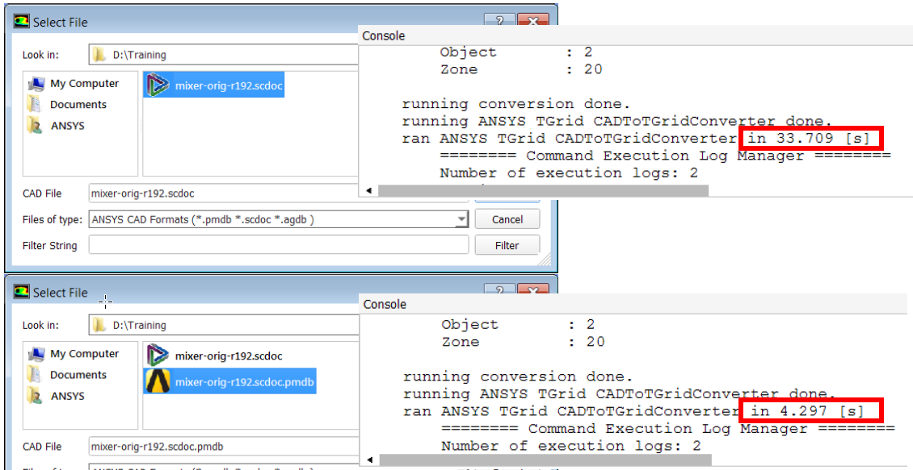

General approaches for Ansys Fluent
===================================

This page gives general pointers for various steps associated with setting up a generic CFD case (may or may not apply to use on HPC). 

.. attention::

    Note that :ref:`General approaches for Ansys Fluent` and :ref:`Best practices` are discussing pointers, best practices, tips and tricks for Ansys Fluent, and are not specific for HPC usage. 

CAD Modelling
-------------

- SPACECLAIM which is the default CAD tool for Ansys Fluent, is a Windows software. Hence the files saved from SPACECLAIM should be linux compatible. 
- Incase a CAD model is not readable in the linux version of Flunet (on HPC), in your Windows, change this format to the appropriate on using SPACECLAIM, before importing it with ``/file/read-case/`` within an HPC environment. 
- Named selections are also not gauranteed to be identified within Fluent meshing. Hence, this need to be converted to a correct CAD format (.pmdb, .STEP, .iges etc) within SPACECLAIM, and tested for each before a corrected version could be identified for HPC usage. 
- Note that .pmdb format also significantly reduces import time within Fluent sesison. 

- Design modellor (another CAD tool within static structural standalone of workbench) can also be used to create .agdb file format that can be used in linux version of Flunet for HPC. Test before using with a simple CAD file. 

Watertight geometries
^^^^^^^^^^^^^^^^^^^^^

- The watertight geometry workflow is not available in workbench, but only in the standalone operation. 
- Import geometry within the watertight geometry workflow does not support .msh, .stl, .tgf formats. 
- Periodicity is not directly supported and may be required to be created manually. This applies for both transational and rotational periodicity. 
- In watertight geometry workflow, there is no local curvature and or proximity size controls (for v2019R2, and may update with higher versions). 
- One global boundary layer will control on all walls. 

.. figure:: images/watertight.png

The image above gives a basic CAD import workflow that is used to create a mesh suitable for running a CFD solver. 

Surface meshing
^^^^^^^^^^^^^^^

Following a geometry import, the next step is to surface mesh the model. 

- Surface mesh is the starting point for enclosing regions for creating a volume mesh. 
- The triangular surface mesh is controlled by the sizing function. 
- Global sizing function defined by the entries in ``Create surface mesh task``
- Global mesh settings are also valid and applied on all surfaces. 
- Local size meshing are defined in ``Insert local sizing tasks``
- Local mesh settings provide control in specific areas of the model. 
- As many as wanted local mesh sizings can be added. 
- Mesh size on scoped zones can be smaller than the target size in areas where a smaller size is calculated by a global size function. 

.. figure:: images/meshsizes.png

- Named selections within SPACECLAIM is another important feature that can be used to set custom surface (and volume mesh) settings. 
- BOI (Bodies of influences) should not have any shared topologies. This can be achieved by creating a separate component. 
- Multiple BOIs can be used however. 
- Overlapping BOI bodies are possible so long as they are not connected. 
- Mesh previews are available for maximum and minimum sizes of cell sizes. 
- Growth rate can be decreased to achieve a finer resolution at the expense of longer computation time. Simple tests could be conducted with a coarses growth rates. 

.. figure:: images/growthrate.png

-  Curvature and proximity will refine around the curvatures while proximity will be scoped to edges. (Use 10-12 degrees for aerodynamic surfaces.)

- Mesh quality can be reported in the Fluent console. Say for the metric of skewness, 0 is a perfect triangle to 1 (degenerate). 

- The volume mesh quality is determined from surface mesh quality. Ideally max surface mesh skewness ``< 0.7`` will be good for a volume mesh. 
- Bad surface mesh can be improved by setting an ``Improve surface mesh`` task, after a required quality threshold such has skewness less than 0.7 was difficult to achieve. 
- Ultimately the volume mesh quality will determine the quality of your results. 
- Often worthwile to test by proceeding the available mesh as well, to understand what happens. 

Volume meshing
^^^^^^^^^^^^^^

- Capping surfaces are used to create a volume region which is later used to create a volume mesh. 
- Any combination of solid, fluid or dead regions are allowed to create an enclosure. This is selected at the start where a geometry could contain only solid regions, fluid regions with no voids, or all of the above. 
- Region type can change if the correct type is not assigned apriori. 
- Named selections used to create labels for capping surfaces should not include "inlet" or "outlet", as this will trigger the zone assignment to change from fluid to solid. 
- A region is assigned fluid region if the body has a name with strings "fluid*", "air*" or "enclosure". 
- Any regions sharing "internal" boundaries will change to fluid regions. 
- By default all bodies are considered solid regions and voids are considered dead regions. 

- For cases with high accuracy requirements for boundary layer effects, consider using 10-20 layers for high fidelity resolution. 

- Smooth-transition uses ratio of last prism cell height to the size of the first non BL cell. 
- This is useful for smooth growth rate and prism cell to volume change at outer BL edge. 
- Unfortunately no control over the first cell height is available making it difficult for ``y+`` calculations.
- Aspect-ratio uses ratio of the first prism cell height to the size of the base prism. 
- This is useful for variable mesh sizes on boundaries and consistent growth rate. 
- However, again less useful for 1st layer cell height and inconsistent total height. 
- Uniform setting applies same first layer height. 
- This helps to control the first layer height and provides a consistent first layer height. 
- This is also sometimes difficult with high or low aspect-ratio cells. 
- Last ratio uses same first layer height and same ratio of last prism. 

- Four volume meshing are available. Tetrahedral, hexcore, polyhedra, poly-hexcore. 
- In most cases, poly-hexcore achieves a lower cell-count, uses less RAM during solve and achieves faster time to solution than comparable standard hexcore or polyhedral meshes. 
- A hexcore mesh is always non-conformal at the hex-tet transition and mesh can only be used with solvers that support non-conformal cells (Fluent)
- Buffer layers can be used to control the growth transition and a value of 2 is recommended. 

.. figure:: images/bufferlayers.png

- Peel layer is the ability to make the core region in hexa closer or further to the boundary prisms, with a recommended value of 1. 

- Volume mesh quality can be checked by mesh-> Check quality in console. This reports the orthogonal quality. 
- orthogonal quality is a measure of alignment between normal vectors of the cell and vectors connecting cell centroids with face centroids and with centroids of neighbouring cells.
    - Orthogonal quality ranges from 1 (perfect) to 0 (poor).
    - Ansys Fluent documentation recommends ``minimum value > 0.01``. 
    - Aim for ``minimum value > 0.1`` if the above is not achievable. 

Physics set up
--------------

- Default solver settings only need to change if the simulation is transient or of high speed compressible flow. 
- Commonly used models are Energy (for heat transfer applications), Radiation, Viscous (for turbulent applications). 
- Some advance models being Multiphase, species and combustion, discrete phase. 
- Setting up energy model for heat transfer equations requires defining material properties like specific heat and thermal conductivity, as well as boundary conditions in form of temperature for flow boundaries, and thermal boundary conditions for walls.
- Similarly, turbulence in Ansys Fluent is defined based on Reynolds number, which is again dependent on length scale of the flow.
- Internal flow, Re > 2300. For external flow, Re > 500,000 along a surface and Re > 20,000 around an obstacle are termed as turbulent.
- For materials, a set of pre-defined database is available, which can either be defined or new materials can be created.
- For incompressible flows, density is constant. For ideal gas properties, piecewise polynomial function can be applied :math:`\rho = f(T)`, incompressible ideal gas law can also be applied: :math:`p = p_{operating}/RT`. Note that: :math:`p_{operating}` should be close to the mean pressure of the problem. 
- For compressible flows: :math:`\rho = p_{absolute} / RT` can be used. 
- Operating pressure represents the absolute datum from which all relatives pressures are measured.
- Pressures specified at the boundary conditions and initial conditions are relative to the operating pressure. 
- Operating pressure is also used to avoid rounding off errors that occur when dynamic pressure differences in a fluid are small compared to the absolute pressure level. 
- :math:`p_{absolute} = p_{operating}+p_{relative}`.
- Zones are either defined for cells or boundaries. 

- For instance from the image above, a simulation of copper heating coil in water will require a :blue:`fluid zone` and a :red:`solid zone`. 
- The equations of flow and heat transfer will be solved within the :blue:`fluid zone`. While those of only heat transfer equations will be solved within the :red:`solid zone`. 
- To account for rotational motion, the impellers are assigned a rotating domain. The :green:`impeller fluid zone` will use equations in the rotating frame of reference, while elsewhere it will be stationary frame of reference. 
- A porous zone can also be defined, where pressure loss in flow can be determined via user inputs of resistance coefficients to lumped parameter model. 
- Lastly, to define a problem with unique solutions, dependent flow variable information should be displayed at the domain boundaries. i.e. fluxes of mass, momentum, energy etc. 

.. attention::

    Poorly defined boundary conditions can have significant negative impact on your solution. 

- For geometries creating a (re) circulation zone, allow the flow to develop before an outlet boundary condition is defined. 
- when there is 1 inlet and 1 outlet, velocity inlet and static pressure at outlet will be the most robust definitions. (The inlet total pressure is an implicit result of the prediction.)
- Mass flow rate at inlet with static pressure at outlet is also a robust definition for 1 inlet and 1 outlet geometries. 
- Total pressure at inlet and static pressure at outlet will be dependent or sensitive to inital guesses. 
- Total pressure or mass flow rate at inlet and outflow boundary at outlet should not be used, as the static pressure level is not fixed. 
- Mass flow at inlet and outflow combination will work only when density is constant. 
- Velocity at inlet and velocity at outlet will make the system numerically unstable. 
- Locations and types of boundary conditions are extremely important for good convergence and accurate results. 

Solving
-------

A general approach to solving a CFD probelem is indicated below. 

    The above image generally summarizes the logic to approach solving a CFD case. 

- Fluent has two solvers, pressure-based and density-based. Pressure based default should handle most problems. (Mach 0~2 or 3). Density based solver is only used for higher mach numbers, or for capturing interacting shock waves. 
- Pressure-velocity coupling will be needed by pressure-based solver. 
- SIMPLE is good for majority of basic incompressible applications. 
- Coupled is mostly used by compressible applications. (Pressure-based coupled solver or PBCS). However also preferred for incompressible flows such as bouyancy or rotation.
- PISO is recommended for transient calculations. 
- SIMPLEC is primarily of academic interests. 

- Under-relaxation factors :math:`\alpha` is included to stabalize the iterative process for pressure-based solver. 
- The final converged solution is independent of under-relaxation factors. (Only number of iterations is dependent.)
- Appropriate settings are also best leared iteratively. 

- Two methods control using the pressure-based coupled solver. These are courant number and pseudo-transient.
- Courant number (defaults at 200) can be reduced to 15-20, for problems that are difficult to converge of for multiphase and combustion problems. 
- Lower Courant number makes the solution more stable, while higher Courant number converges faster. 
- As with under-relaxation factors, optimal values are best determined from best learned from experience. 
- Peudo-transient option along with Pressure-based coupled solver can lead to better convergence. However, this is slightly more computationally expensive, but is more robust and requires fewer iterations. 

- For spatial discretization setttings, defaults is recommended for most cases. 
- For natural convection problems, where gravity has been activated, the pressure discretization must be changed to PRESTO or body-force weighted. 

- Initialization is required before starting solution. This means every cell in the mesh should be assigned with a value, which will serve as an initial solution for the guess. 
- A realistic solution improves the solution. 
- Poor initial guess may cause the solver to fail during first few iterations. 

- As seen from the images, standard-hybridization will assign same values to every cell in the mesh. Hybrid initialization is slightly more realistic with non-uniform value distribution. While FMG initialization is much more realistic initialization, will take longer to generate. 
- In general, the closer the initial guess is to the final solution the fewer iterations will be needed to reach convergence. 

- For convergence, the following should generally hold true. 
- All discrete conservation equations, are obeyed in all cells to a specified tolerance. 
- The residual measures the imbalance of the current numerical solution and is related to but not equal to the numerical error. 
- Overall mass, momentum, energy and scalar balances are achieved. 
- Target quantities reach constant values, e.g Pressure drop integral, Local velocity at specified position. 
- Generally a reduce in residuals by three orders of magnitude can be a sign of convergence, although this can be assessed via several means. 
- Scaled energy residual should reduce to :math:`1e-6` for pressure-based solver. 
- Scaled species residual may need to decrease to :math:`1e-5` to achieve species balance. 
- Best practice is to also monitor quantitative variables to decide convergence. 
- This can be done by surface reports, report definitions for key variables/quantities. 

.. figure:: images/convergediter.png

- As indicated in the image above, convergence criteria can be specified, on reaching those values, the solution would be declared converged by the solver. 
- The net flux imbalance (checked via flux reports) should be less than 1% of the smallest flux through the domain boundary. 

Postprocessing
--------------

Post processing (for ADA) is best done via the Visualization nodes as discussed in the section :ref:`Via Visualization Nodes`. However is best done using the saved .CAS and .DAT format of the completed solution in Ansys. 

- Surfaces, are either planar, cylinderical etc, cutting through the model. 
- Iso-surface is to create 3D surface showing where a given value exists (temperature, concentration etc)
- Mesh, contours, vectors, pathlines, particle tracks etc. 
- Scenes can be created that can overlay multiple renders onto one another, giving a combination of contours, pathlines, vectors or others. 
- Plots feature is used for XY (2D) plots based on pre-defined values of the quantities of interests.
- Reports (Flux, Surface integrals or Volume integral) will indicate cumulative value of chosen quantity of interest. 
