Best practices
==============

This page gives general best practices for various CFD applications for which Ansys Fluent can be used. 

- Understand why is CFD needed in the first place?
- This can be best answered, if you want a design and optimization of the components involved. Does accuracy matter and if yes, how much?. Is it a safety analysis, in which case the accuracy should be highly regarded. Or you need to perform a virtual prototype?

Errors
------
- Errors, in order of magnitude are breifly discussed as follows, 
- Round-off errors is a computer's ability to work a certain numerical precision. The causes for machine round-off are usually high grid aspect ratios. Large differences in length scales, or large variable range. 
- Identifying round off errors is best done by comparing a solution that has been compared with single precision. 
- Iteration errors is the difference between converged solution and the solution at iteration `n`. These are best observed by plotting the value of quantities of interest as the solution iterates and selecting a tighter convergence criterion and continueing iterating and plotting. 
- This can be repeated until values of interests no longer change. And finally, report mass and energy fluxes to ensure these are being conserved. 
- Discretization errors is the difference between the solution on a given grid and exact solution on an infinitely fine grid. 
- Solution errors is the difference between converged solution on current grid and "exact" solution of model equations. 
- Model errors is the difference between exact solution of the model equations and reality (data or analytic solution). 
- Due to model errors, discrepancies between data and calculations can remain, even after all numerical errors have become insignificant. 

Mesh
----

- Chosing mesh strategy, should require answering the question, how accurate does one want it to be?, how much effecient should it be and how easy is it to generate the same?
- More specifically, what's the maximum skewness and aspect ratio that can be taken as appropriate, should there be low cell count for resolving overall flow features vs high cell count for greater details and the time available for the defined mesh settings. 
- The goal is to find the best compromise between accuracy, efficiency and easiness to generate the mesh. 
- To capture flow physics, meshes should be able to capture boundary layers, heat transfer, wakes/shocks and flow gradients. 
- Recommended meshing guidielines for boundary layers include resolving both, veolocity and thermal boundary layers. 
- Mesh should having minimum 10-15 elements across boundary layer. 
- Mesh expansion ratio in the wall normal direction should be moderate :math:`\leq 1.2 .....1.3`
- :math:`y+ ~ 1` for heat transfer and transition modelling. 

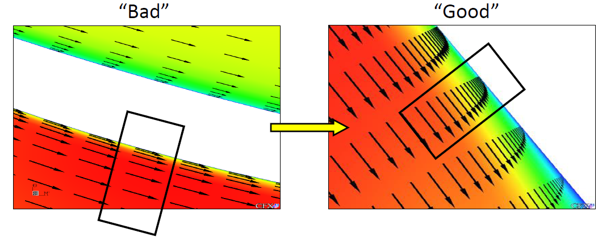

    Capturing the boundary layer appropriately is key. 

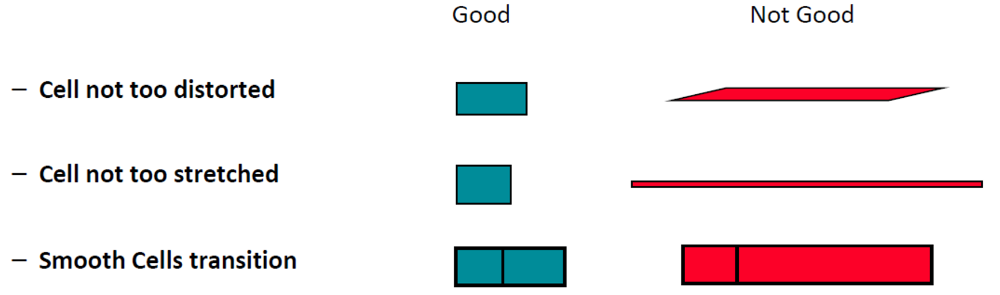

    Types of mesh on which the quality depends. 

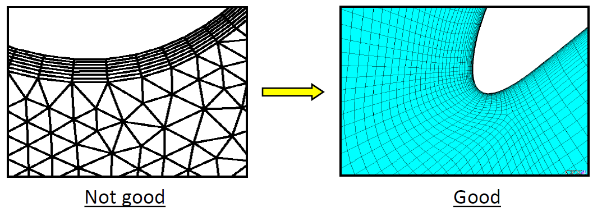
    
    Sudden changes in a mesh density should be avoided.

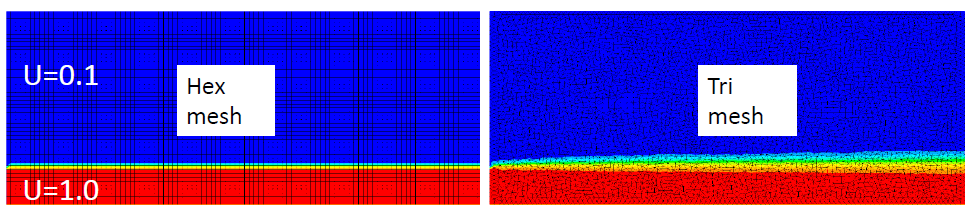

    Quad/Hex aligned with flow are more accurate than tri with same interval size. 
    Image shows contours of axial velocity magnitude for an inviscid co-flow jet.  

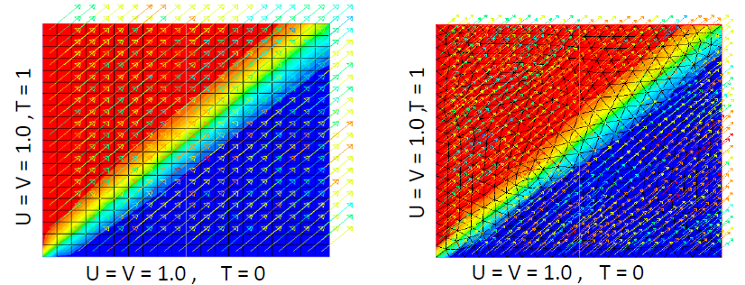

    For complex flows without dominant flow direction, Quad and Hex meshes lose their advantage. (Contours of temperature for inviscid flow.)

Turbulence
-----------

The following turbulence models is available within Ansys Fluent.

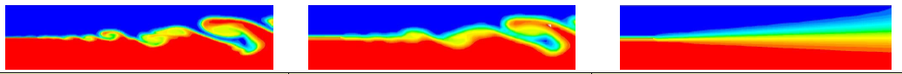
    
    Three types of approaches to turbulent flow. 

- DNS or Direct Numerical Simulation numerically solves teh full unsteady Navier-Stokes equation. 
- DNS also resolves the whole spectrum of scales. 
- Modelling of other terms in NS is not required. 
- Computationally expensive, neither practical for industrial applications. 

- LES or Large eddy simulation solves the filtered NS equations. 
- Some turbulence is directly resolved. 
- Less expensive than DNS but efforts and computatinoal resources needed are still too large for most practical applications. 

- RANS or Reynolds Averaged Navier Stokes Simulation solves the time-averaged NS equations. 
- All turbulent flow is modelled. 
- For most problems, the time-averaged flwo are all that is needed. 
- Widely used industrial approach. 

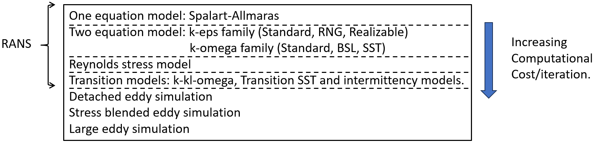

    Increasing computatinal cost of each turbulent approach in Fluent. 

- For general approaches, Realizable :math:`k-\epsilon` or SST :math:`k-\omega` models are recommended choices for standard cases. 
- Where highly accurate resolution of boundary layers is critical, such as applications involving flow separation or finely resolved ehat transfer profiles, SST :math:`k-\omega` is preferred. 
- If only a crude estimate of turbulence is required, the standard :math:`k-\epsilon` model can be used. 
- This might occcur in problems where teh solution depends more strongly on other physical models or modelling assumptions than on the turbulence model.  
- The dimensional velocity profile as :math:`U/U_{\tau} = u_{\tau} = \sqrt{\frac{\tau_{wall}}{\rho}}`, defines the wall distance as :math:`y+ = \frac{y\cdot u_{\tau}}{\nu}`

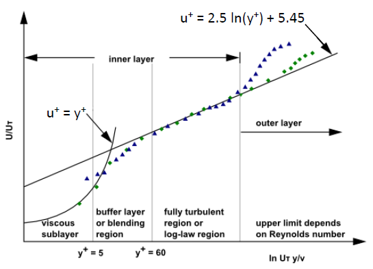

    Using non-dimensional velocity and non-dimensional distance from the wall results in a predictable boundary layer profile for a wide range of flows. 

- For CFD, the most important are the viscous sublayer, immediately adjacent to the wall and log-layer, slightly further away from the wall. 
- Different turbulent models require different inputs depending on whether the simulation eneds to resolve teh viscous sublayer with the mesh. 
- Using wall functions to involve utilizing predictable dimensionless boundary layer profile shown on slides 9 & 10 to determine conditions at wall from conditions at the centroid of the wall adjacent mesh cell. 
- This means the cell should be located in the log-layer. 
- To locate the first cell in log-layer, it should typically have a y+ value such that :math:`30\leq y+ \leq 300`
- Generally speaking, 
    - For very high Re, y+ can be higher if still in log layer (for instance a large ship Re~10^9, values greater than 1000 are safe)
    - For very low, but still turbulent Re, the log layer may only extend to y+~ 300, in which case y+~30 would be too coarse to allow a sufficient number of mesh cells across boundary layer. 
    - To fully resolve boundary layer on important walls, try to have atleast 10 mesh cells across boundary layers. 

- Resolving viscous sublayer, first grid cell needs to be at y+~1 and a prism layer mesh with growth rate no higher than ~ 1.2 shoudl be used. 
- This causes the mesh count to increase significantly. 
- If the forces on heat trasnfer on wall are key to your simulation (aerodynamic drag, turbomachinery blade performacne, heat transfer) this is the approach you will take and the recommended turbulence model for most cases is SST :math:`k-\omega`. 
- Fewer nodes are needed normal to the wall when wall functions are used compared to resolving the viscous sub-layer with the mesh. 

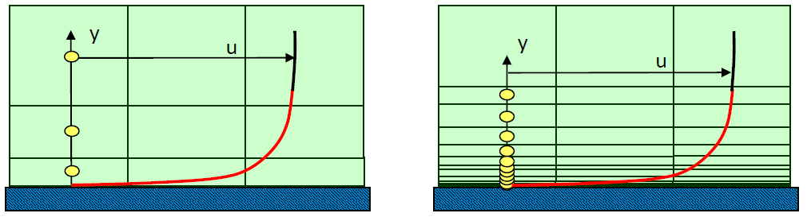
    
    Red line indicates the first node wall distance reflected by y+ value. 

Example y+ calculation 
^^^^^^^^^^^^^^^^^^^^^^

A sample y+ calculation is indicated for the following smooth plate flow as follows, 

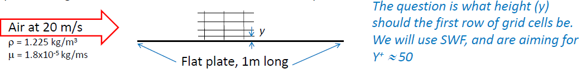

    Flow over flat plate with air at 20m/s, at a given density and viscosity. 

.. math::

    Re = \frac{\rho V L}{\mu} = 1.4x10^6 \\

The target y+, after rearranging, is 

.. math::

    y+ = \frac{\rho U_{\tau} y } {\mu} \\
    y = \frac{y+ \mu}{U_{\tau} \rho}

:math:`U_{\tau}` is now requried  which is obtained as, 

.. math::

    U_{\tau} = \sqrt {\frac {\tau_{w}}{\rho}}

The wall shear stress or :math:`\tau_{w}` can be found from the skin friction coefficient, :math:`C_f` as,

.. math::

    \tau_w = \frac{1}{2} C_f \rho U_{\infty} ^2 

For a smooth plate as shown in the figure, skin friction is obtained as 

.. math::

    C_f = 0.058 Re_{l} ^ {-0.2}

Re being known, will yield the :math:`C_f` as follows, aiming for a y+ of 50,

.. math::

    C_f = 0.0034 \\

    \tau_w = \frac{1}{2} C_f \rho U_{\infty} ^2  = 0.83 (kg/ (ms^2)) \\

    U_{\tau} = \sqrt{\frac {\tau_{w}}{\rho}} = 0.82 m/s\\

    y = \frac{y+ \mu}{U_{\tau} \rho} = 9 \cdot 10^{-4} m

Meaning, the very first cell next to the boundary should have the heigt of approximately 1mm. Aiming for a y+ of 1, 50 will be replaced with 1 in the above formula, giving :math:`y=1.8 \cdot 10^{-5}`.

- Wall functions however also have some limitations. In some situation, such as boudnary layer separation, the boundary layer profile is not logarathmic which means that wall functions, which are based on logarithmic velocity profile, do not correctly predict the boundary layer. 

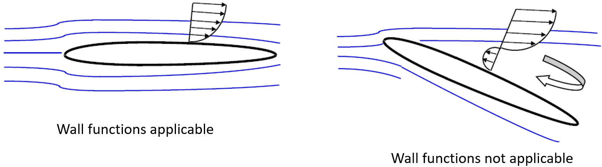

Lastly for for turbulent inlet conditions, 

- Normal turbulent intensities range from 1% to 5%.
- Default turbulent intensity value 5% is sufficient for nominal turbulence through a circular inlet, and is good estimate in absense of experimental data. 
- For external flows, turbulent viscosity ratio of 1-10 is typically good. 
- For internal flows, turbulent viscosity ratio of 10-100 is typically good. 
- For fully developed pipe flow at Re=50000, the turbulent viscosity ratio is around 100. 

Heat transfer
-------------

- Conduction, convection (forced and natural), radiation problems  would require solving energy equation. 
- Interphase energy, fluid-solid conjugate heat trasnfer, viscous dissipation, species diffusion etc are some examples. 
- The rate of heat transfer depends strongly on fluid velocity. 
- Fluid properties may vary significantly with temperature. 
- At walls, the heat transfer coefficient is computed by the turbulent thermal wall functions. 

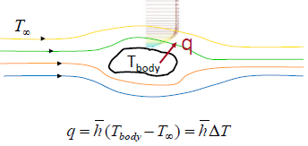

    here :math:`\bar{h}` is average heat transfer coefficient :math:`(W/m^2-K)`

- Conduction is governed by Fourier's Law. Fluent computes conduction in all fluid and solid zones when the eneergy equation is activated. 
- Fourier's law states that the heat trasnfer rate is directly proportional to gradient of temperature. 
- Mathematically, :math:`q_{conduction} = -k \nabla T`
- Constant of proportionality is thermal conductivity (k), where k may be a function of temperature, space, etc. It can also be isotropic materials, where k is a constant value. This can also be for anisotropic materials, where k is a matrix. 

- Thermal conditions at wall can have the following definitions,

    - Constant heat flux or temperature.
    - Convection, Radiation, Mixed for external environment that is not modelled using user prescribed heat trasnfer coefficient and or external emmissivity and radiation temperature.

.. math::

    q_{conv} = h_{ext}(T_{ext} - T_{w})

    q_{rad} = \epsilon_{ext} (T_{\infty}^4 - T_w^4)

    q_{mixed} = h_{ext} (T_{ext} - T_{w}) + \epsilon_{ext} (T_{\infty}^4 - T_w^4)

- One can also define boundary conditions using system-coupling. i.e. Fluent is coupled with another system in workbench using system coupling. However, this will be difficult to set in Fluent itself for HPC use. 
- Mapped interface is another way of applying boundary conditions, only used with non-conformal interfaces. 

Heat transfer in walls is modelled in several ways, as indicated in the figure below

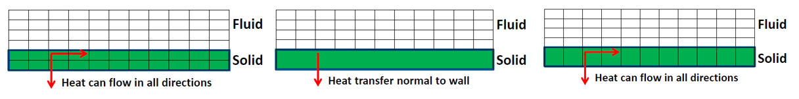

It is often important to model the thermal effects of the wall bounding the fluid but it may not be necessary to mesh it. 

- Meshing the wall in the pre-processor and assigning it as a solid cell-zone. This is the most thorough approach. 
- Another option would be to mesh the fluid region with specific wall thickness and wall conduction accounted for.
- Third option is to enable shell conduction, where one or more layers of virtual cells will be created. 

- Conjugate heat transfer is another type of heat trasnfer problem that can be solved using Fluent. 
- At a wall between a fluid and a solid zone or a wall with fluid on both sides, a wall/ wall_shadow is created automatically by Fluent while reading the mesh file. 

- Natural convection occurs when the fluid density is temperature dependent and heat is added to fluid
- Flow is induced by gravitational foce acting on density difference. 
- When gravity is activated in Fluent, the pressure gradient and body forces terms in the momentum equation are rewritten as

.. math::

    - \frac{\partial p}{\partial x} + \rho g \Rightarrow  - \frac{\partial p^\prime}{\partial x} + (\rho - \rho_0)g \\

    p^\prime = p - \rho_0 g x

- The transformation aviods roundoff error when gravity is enabled. 

- For radiation, where mode of energy transfer is electromagnetic waves. 
- For semi-transparent bodies (e.g. glass, combustion product gases), radiation is a volumetric phenomenon since emissions can escape from within bodies. 
- For opaque bodies, radiation is essentially a surface phenomenon since nearly all internal emissions are absorbed within the body. 
- Radiation shoudl be included if in a simulation, if 

.. math:: 

    q_{rad} = \sigma \epsilon (T_{max} ^ 4 -  T_{min}^4)

is of the same order of magnitude than the convective and conductive heat tranfer rates. This is usually true at high temperatures but can also be true at lower temperatures depnding on application. 

- Estimate the magnitude of conduction or convection heat transfer in the system as 

.. math::

    q_{conv} = h (T_{wall} - T_{bulk})

And then compare :math:`q_{rad}` with :math:`q_{conv}`. 

- Optical thickness :math:`(a+\sigma_s)L` should be determined before choosing a radiation model. (Where a is absorption coefficient, :math:`\sigma_s` is scatterring coefficient and is often 0, while L is mean beam length.)
- Optically thin means that the fluid is transparent to the radiation at wavelengths where the heat transfer occurs. 
- Optically thick means that the fluid absovs and re-emits teh radiation. 
- Choosing a radiation model, must be appropriately selected for the optical thickness of the system being simulated. 
- For instance, surface to surface (S2S) can have 0 optical thickness.
- Solar load model, when it is 0 except for window panes. 
- Rosseland model for thickness :math:`\geq` 5. This is inexpensive but limited in applicability. 
- Discrete ordinates model (DO) is valid for all thickness, and is also very comprehensive. This is Computationally expensive than S2S.
- Discrete transfer method (DTRM) is also valid for all thickness, and is cheaper than Discrete ordinate, but not available in prallel so is rarely used. 
- Monte carlo (MC) is the most accurate model but is also computationally expensive.

Transient flow
--------------

Transient flows originated from unsteady flows observed in form of instability within the fluid or non-equilibrium initial fluid state. 
Exapmles are natural convection flows, turbulent eddies of all scales, fluid waves, gravity waves and shock waves. 

- Forced unsteadiness is also observed where time-dependent boundary conditions and source terms drive the unsteady flow field. 
- Pulsing flow in a nozzel, rotor-stator interaction in a turbine stage. 

- Natural frequencies (Strouhal numbers), time averaged RMS values, time related parameter (time required to cool a hot solid, residence time of a pollutant) and spectral data fourier transform are all examples of quantities of interests for unsteady flow. 

- Transient simulations are solved by computing a solution for many discrete points in time. 
- At each time point, a solution should be iterated. 

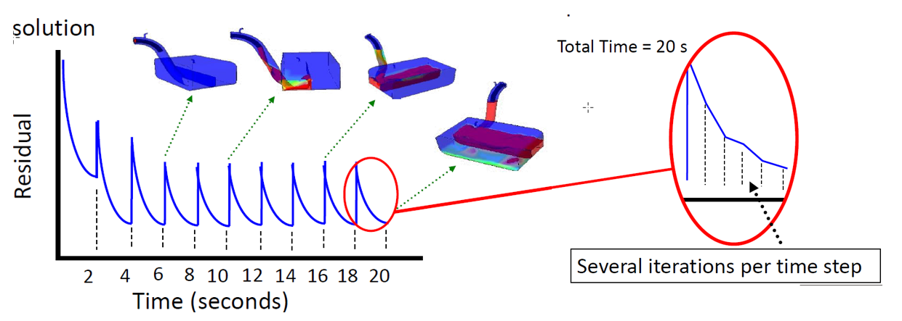

A time step size is an important parameter in transient simulations. This should be small enough to resolve time-dependent features

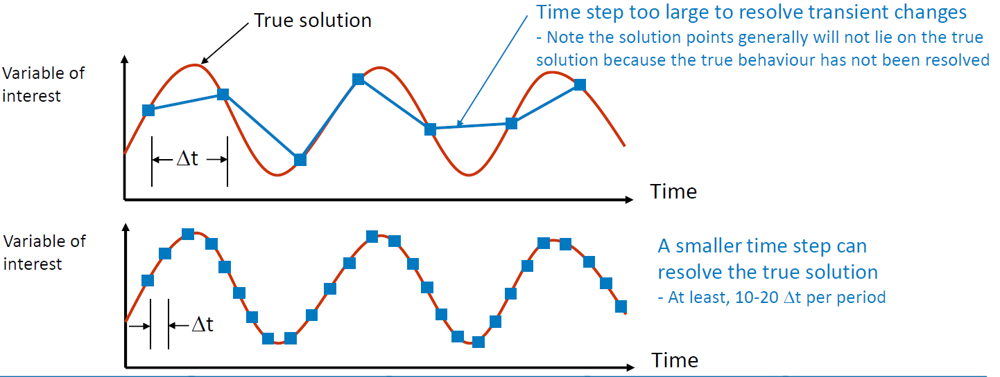

    Importance of time step within Transient settings. 

- Note that residual plots for transient simulations are not always indicative of a converged solution. 
- Time step size should be selected such that the residuals reduce by around three orders of magnitude within one time step. 
- For smaller time steps, residuals may only drop 1-2 orders of magnitude. Look for a monotonic decrease throughout the time step. 
- The quantity of interest may be changing very slowly, (e.g. temperature in a solid) but a larger time step could not be used if other quantities (e.g. velocities) have smaller timescales. 

- Courant number is often used to estimate time step. i.e 

.. math::
    
    \text{Courant number} = \frac{\text{Characteristic flow velocity} \times \delta t}{\text{Typical cell size}}.

This would give the number of mesh elements the fluid passes through in one time step. 
- Typical values are 1-10, but in some cases higher values are acceptable. 

Tips for selecting time step
^^^^^^^^^^^^^^^^^^^^^^^^^^^^

- Usual case, 

.. math::
    
    \delta t = \frac{1 \times L}{3 \times V}

, where L is characteristic length and v is characteristic velocity. 

- For turbomachinery problems, 

.. math::
    
    \delta T = \frac{1 \times \text{Number of Blades}}{10 \times \text{Rotational velocity}}

- For natural convection problems, 

.. math::
    
    \delta T = \frac{L}{\sqrt(g \beta \delta T L)}

- For Conduction in solids, 

.. math::
    
    \delta t = \frac{L^2}{(\frac{\lambda}{\rho C_p})}

- A smaller time step will typically improve convergence at the cost of making the simulation longer. 
- With pressure based solver, use PISO scheme for pressure-velocity coupling. This scheme provides faster convergecne for unsteady flows than the standard SIMPLE approach. 
- Select the number of iterations per time step to be around 20. 
- It is usually better to reduce the time step size than to do to many iterations per time step. 
- Remember that accurate intial conditions are as important as boundary conditions for unstead problems. 
- Initial conditions should always be physically realistic. 
- to iterate without advancing in time, specify zero time steps. This will instruct the solver to converge the current time step only. 

.. attention::

    Feel free to write to atul.singh1@nottingham.ac.uk for any Fluent related questions. (Suggestions, corrections if any or additions?). 